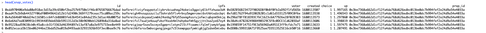

# ArbSnapshotData
To develop an automated pipeline that efficiently extracts data on Arbitrum Governance Proposals and their corresponding votes from Snapshot, the process involves several key steps. First, it requires setting up a mechanism for regularly querying the Snapshot API or relevant endpoints to retrieve the latest information on governance proposals within the Arbitrum ecosystem. Once the data is fetched, the pipeline must include a data processing and transformation layer. This layer is responsible for cleaning, structuring, and normalizing the raw data to ensure it is in a usable format.

### Walkthrough

#### 1. Scrape all the Snapshot data and parse it into respective Dataframes.

- `Rscript scrape.R`

It uses `helperfuncs.R` under the hood which have the functions required to talk with GraphQL endpoint and fetch the required data.

Proposal Data from Snapshot

&nbsp;
&nbsp;

Votes Data from Snapshot

&nbsp;
&nbsp;
